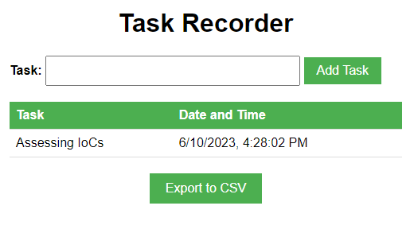

# About
A very basic and trivial HTML only based task recorder. No session save. But allows for export to CSV.

# Usecase
- Quickly able to document a task being worked on and when commenced.
- Useful for building out a basic timeline of actions / tasks conducted.
- Ability to export to simple csv.

# Instructions
- Download or Copy HTML
- Run
- Use

# Background
- Written with ChatGPT
